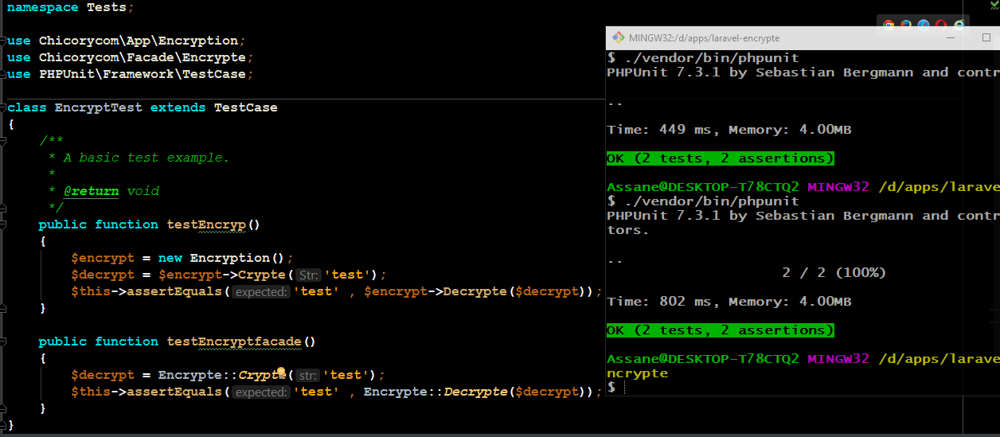

# laravel-encrytion

##chicorycom
> Votre Intégrateur Reseau Système et Sécurité.


[](https://github.com/chicorycom/laravel-encrypt/issues)
[](https://github.com/chicorycom/laravel-encrypt/network)
[](https://github.com/chicorycom/laravel-encrypt/stargazers)
[](https://github.com/chicorycom/laravel-encrypt)
[](https://twitter.com/intent/tweet?text=Wow:&url=https%3A%2F%2Fgithub.com%2Fchicorycom%2Flaravel-encrypt)




## Installation

OS X & Linux & window:

```sh
composer require chicorycom/laravel-encrypt
```
- v0.1.0 requires PHP >= 7.1

## Usage example
```php
php artisan vendor:publish --provider="vendor\chicorycom\laravel-encrypt\EcryptServiceProvider" --tag="config"
.env CH_ENCRYPT=YOUR-KEY

$en = new Encryption();
$e = $en->Crypte('Hello Work);
UCRTNgx1B3A=

$en->Decrypte('UCRTNgx1B3A=');
Hello Work
```

> use Facade
```php
Encrypte::Crypte('Hello Work');
WS0EYQB5AXY=

Encrypte::Decrypt('WS0EYQB5AXY=');
Hello Work
```

## Meta

[@Assane Sarr](https://www.facebook.com/chicorycom.net) – chickoryproduction@gmail.com

Distribué sous la licence MIT. Voir `` LICENCE`` pour plus d'informations.

[https://github.com/chicorycom/encryption.git](https://github.com/chicorycom/)

# laravel-encrypt
